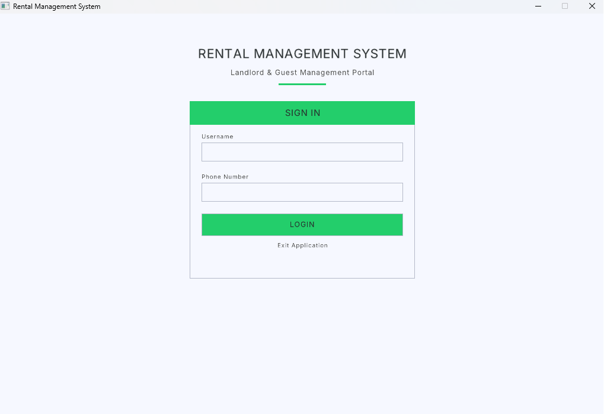
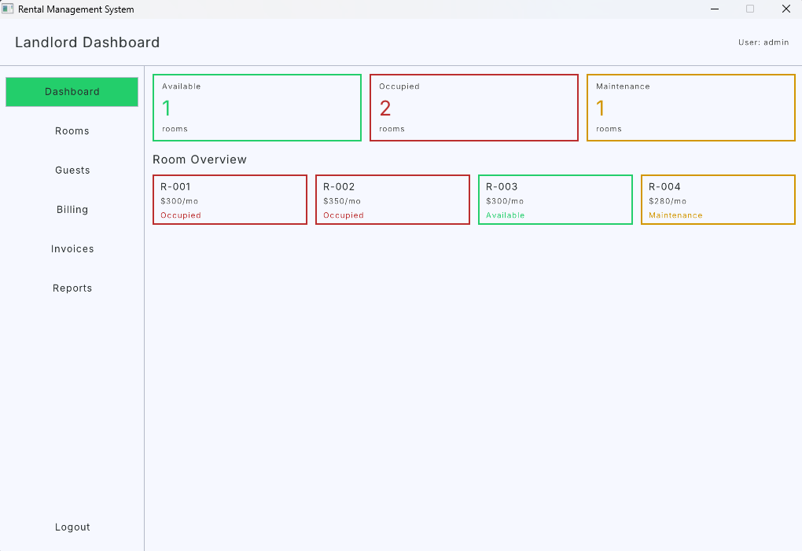
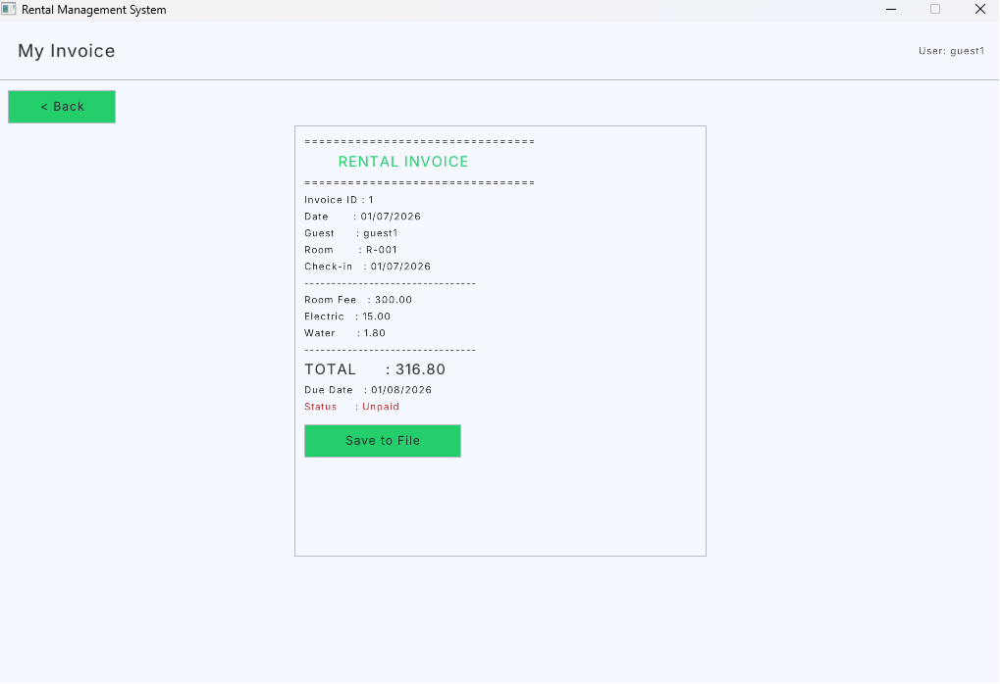

# 🏨 Rental Management System

A desktop Rental Management System built in C with a graphical user interface powered by Raylib. Designed to help manage rooms, guests, billing, invoices, and reports — all from a single application.

---

## 📋 Overview

This project is a fully functional rental management system written in C, featuring a GUI built with the Raylib library. It covers the full workflow of a rental business — from user authentication and room management to guest tracking, billing, invoicing, and report generation.

---

## 📸 Screenshots

<table>
  <tr>
    <td align="center" width="50%">
      <b>🔐 Login Screen</b><br/>
      
    </td>
    <td align="center" width="50%">
      <b>🖥️ Dashboard</b><br/>
      
    </td>
  </tr>
  <tr>
    <td colspan="2" align="center">
      <b>🧾 View Bills</b><br/>
      
    </td>
  </tr>
</table>

---

## ✨ Features

- 🔐 **User Authentication** — secure login system to protect access
- 🛏️ **Room Management** — add, update, and track room availability
- 👤 **Guest Management** — register and manage guest information
- 💰 **Billing System** — generate and manage bills for guests
- 🧾 **Invoice Generation** — create and export invoices
- 📊 **Reports** — view summaries and reports of rental activity
- 💲 **Rate Management** — configure and update room rates
- 🖥️ **Graphical UI** — clean desktop interface built with Raylib

---

## 🛠️ Tech Stack

- **Language:** C (C99 standard)
- **GUI Library:** [Raylib](https://www.raylib.com/)
- **Build Tool:** GNU Make (Makefile)
- **Platform:** Windows

---

## 📁 Project Structure

```
Rental-Management-system-C-project/
│
├── src/
│   ├── main.c        # Entry point
│   ├── auth.c        # Authentication logic
│   ├── room.c        # Room management
│   ├── guest.c       # Guest management
│   ├── billing.c     # Billing system
│   ├── invoice.c     # Invoice generation
│   ├── report.c      # Report generation
│   ├── rates.c       # Rate management
│   ├── ui.c          # UI components
│   └── utils.c       # Utility functions
│
├── include/          # Header files
├── lib/raylib/       # Raylib library files
├── data/             # Data storage files
├── resource/         # Assets and resources
├── Makefile          # Build configuration
└── rental_system.exe # Compiled executable
```

---

## 🚀 Getting Started

### Prerequisites

- **Windows OS**
- **GCC compiler** (via MinGW or similar)
- **Make** utility

> Raylib is already bundled in the `lib/raylib/` directory — no separate installation needed.

### Build from Source

1. Clone the repository:

```bash
git clone https://github.com/SXTH2105/Rental-Management-system-C-project.git
cd Rental-Management-system-C-project
```

2. Build the project:

```bash
make
```

3. Run the application:

```bash
./rental_system.exe
```

### Run the Pre-built Executable

A pre-built Windows executable is included in the repo. Simply double-click `rental_system.exe` to launch the application directly.

---

## ⚠️ Notes

- This project is built and tested on **Windows** only. The Makefile uses Windows-specific linker flags (`-lopengl32 -lgdi32 -lwinmm -mwindows`).
- The `data/` folder stores persistent data for rooms, guests, and billing records.
- To clean the build, run `make clean`.

---

## 🔮 Future Improvements

- Add search and filter functionality for guests and rooms
- Export reports and invoices to PDF
- Add multi-user support with role-based access
- Port to cross-platform (Linux/macOS) using portable Raylib builds

---

## 👤 Author

**Seth** **+** **Thanun**
- GitHub: [@SXTH2105](https://github.com/SXTH2105)

---

## 📄 License

This project is open source and available under the [MIT License](LICENSE).
